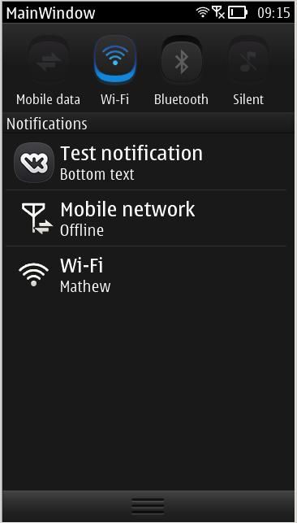

# PiglerPlugin
### by [shinovon](https://github.com/shinovon) and [curoviyxru](https://github.com/curoviyxru)
The indicator plugin implementation, currently avaliable for Symbian/Nokia Belle only, written in Symbian C++.
The purpose of this plugin is to provide easy and open-source API that provides Symbian's notification features.

# Planned things:
* [ ] ~~Research for workarounds for Symbian Anna and Symbian 9.4~~
* [ ] ~~Implement an TCP (or UDP?) server for J2ME and other technology-based apps~~
* [ ] Standard icon pack
* [ ] ~~Icon color change depending on theme (as stated in docs)~~
* [x] Implement indicator icons and various images formats support
* [x] Find a workaround for missing indicators bug until any system indicator is shown on Symbian Belle
* [ ] Implement tap handling/callbacking for indicators
* [ ] ~~Implement a plugin for status pane top indicators~~
* [x] Implement icon sending and resizing
* [ ] ~~Notifications saving to DB and load them on system start~~
* [ ] Reboot phone after package install and uninstall
* [ ] Java JNI methods
* [x] Qt utility methods
* [ ] Application launch on indicator tap
* [ ] Show indicators on lock screen